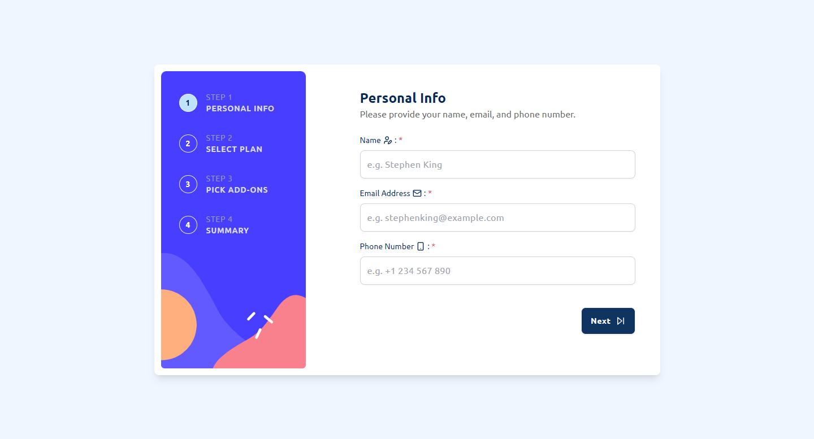

# Multi-Step Form

This project is a multi-step form built with React and Tailwind CSS. The form allows users to navigate through different steps, select a pricing plan, choose add-ons, and view a summary of their selections before submission.

**Features:**

- **Multi-step navigation**: Users can navigate through different steps of the form.
- **Plan selection**: Users can toggle between monthly and yearly plans.
- **Add-ons selection**: Users can pick one or more add-ons.
- **Summary**: Users can review their selections before submitting.
- **Responsive design**: The form is fully responsive.
- **Animations**: Smooth animations are implemented using Framer Motion.
- **Custom validation**: Custom validation and error handling for each step.

**Screenshots:**

**Technologies:**

- **[React](https://react.dev/)**:  
  React is a popular JavaScript library for building user interfaces, particularly single-page applications. It allows developers to create reusable UI components and manage the state of complex applications efficiently.

- **[TypeScript](https://www.typescriptlang.org/)**:  
  TypeScript is a statically typed superset of JavaScript that adds optional types to the language. It helps developers catch errors early in the development process and improves code maintainability by providing better tooling support.

- **[Tailwind CSS](https://tailwindcss.com/)**:  
  Tailwind CSS is a Utility-First CSS Framework that provides low-level utility classes to build custom designs without leaving your HTML. It offers flexibility and efficiency, making it easier to create responsive and highly customizable interfaces.

- **[Framer Motion](https://www.framer.com/motion/)**:  
  Framer Motion is a powerful animation library for React that allows developers to create complex animations and gestures with ease. It offers a simple API for animating components and managing transitions, enhancing the overall user experience.

- **[DaisyUI](https://daisyui.com/)**:  
  DaisyUI is a UI library that extends Tailwind CSS with pre-designed components. It helps developers build modern, consistent UIs quickly by providing a set of customizable components like buttons, forms, cards, and more, all built with Tailwind’s utility classes.

**Links:**

- Solution URL: [View](https://www.frontendmentor.io/solutions/a-simple-multi-step-form-built-with-react-SheNkh1Rey)
- Live Site URL: [https://multi-step-form-3.netlify.app/](https://multi-step-form-3.netlify.app/)

**Author:**

- Frontend Mentor: [Mahmoud ELagamy](https://www.frontendmentor.io/profile/Mahmoud-ElAgamy)
